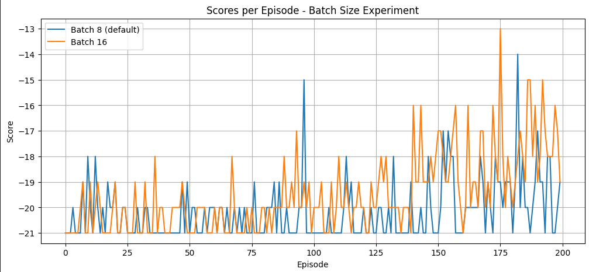
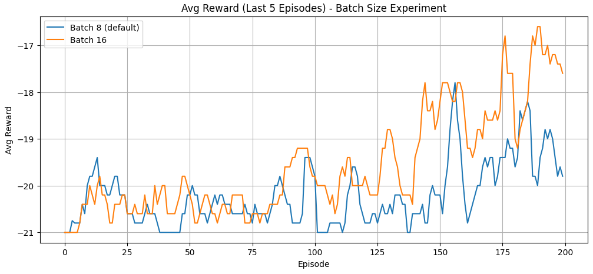
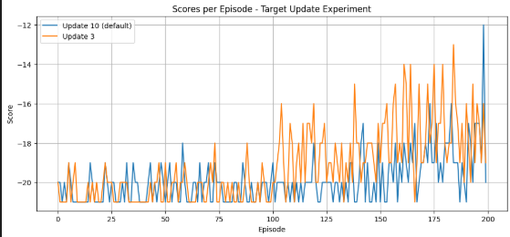
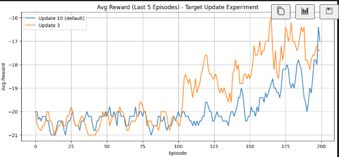

# Assignment 3

# Introduction

This report presents the implementation of a Deep Q-Network (DQN) trained on the PongDeterministic-v4 environment. Image frames are cropped, downsampled, grayscaled, normalized and 4 stacked frames are provided as input to the CNN. Hyperparameters used are  
 

# Final Network Architecture

- - Input: 4 stacked frames of size 84×80
    - Conv1: 32 filters, 8×8 kernel, stride 4 → ReLU
    - Conv2: 64 filters, 4×4 kernel, stride 2 → ReLU
    - Conv3: 64 filters, 3×3 kernel, stride 1 → ReLU
    - FC1: 512 units → ReLU
    - FC2: Output layer with 6 actions

# Experiment 1 – Batch Size (8 vs 16)

Batch size influences gradient stability and sample efficiency.

    - Batch size 8: Faster initial learning but more unstable.
    - Batch size 16: More stable and smoother learning curve\\

# Plots:

---

---

# Experiment 2 – Target Network Update Frequency (3 vs 10)

Update rate affects Q-value stability.

    - Update every 3 episodes: Faster improvement, but oscillates.
    - Update every 10 episodes: More stable convergence.

# Plots

---

---

1.  **Final Recommendation**

Based on the experiments, the following combination proved best:

**• Best Batch Size: 16**

**• Best Target Network Update Rate: Every 10 episodes**

This combination provides superior stability, smoother gradients, and consistent improvement across training compared to more aggressive update strategies. Batch size 16 reduces noise in gradient updates, while updating the target network every 10 episodes prevents oscillations in Q-v
